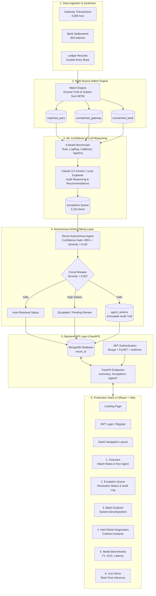

# Recon AI 🤖📊

> **An autonomous agent that closes the finance-ops reconciliation loop across payment gateway, bank settlement, and ledger data, auto-resolving what it can and escalating what it can't.**

[](https://python.org)
[](https://fastapi.tiangolo.com)
[](https://react.dev)
[](https://vitejs.dev)
[](https://www.mongodb.com)
[](https://catboost.ai)
[]()

---

## 🎯 Problem Statement

In high-volume fintech and payment operations, **verification capacity, not generation speed, is the bottleneck**. While generative AI can produce reports and scripts instantaneously, financial reconciliation across payment gateways, bank settlement files, and internal double-entry ledgers remains an error-prone, highly manual chore. When thousands of daily transactions settle in aggregated multi-component batches with varying delays, bank processing fees, and partial refunds, human accounting teams spend hours diagnosing variances. Recon AI solves this by automating three-way multi-source matching, applying calibrated machine learning to classify anomalies, autonomously resolving safe items under strict circuit breakers, and escalating high-stakes discrepancies with plain-English audit trails.

---

## ⚡ What Makes This an Agent, Not Just a Dashboard

Most reconciliation software is purely passive: it produces dashboards, charts, and recommendations, leaving human operators to manually verify, copy-paste, and close ledger items. 

**Recon AI is a genuine closed-loop autonomous agent** that executes the full **Observe → Decide → Act → Report** lifecycle:

- **Observes**: Continuously ingests and synchronizes multi-source raw gateway transactions, aggregated bank settlement batches, and double-entry ledger logs into persistent collections.
- **Decides**: Evaluates non-linear deviations using trained machine learning classifiers (CatBoost and TabPFN-2.5 foundation models) and generates structured audit reasoning via Claude.
- **Acts**: Autonomously closes qualifying exceptions (`recommended_action == "auto_approve"` with clean confidence $> 85.0\%$ and severity $\le 0.60$) directly in MongoDB—marking them as `auto_resolved`, stamping timestamps, and attributing them to `resolved_by: "agent"`.
- **Reports & Audits**: Enforces an immutable, transparent audit trail in the `agent_actions` collection, while an independent **safety circuit breaker** guarantees high-severity items ($\text{severity} > 0.60$) are never touched autonomously and remain escalated for human review.

---

## 🏗️ Full-Stack Agent Architecture



---

## 📈 Key Results & Performance Benchmarks

### 1. Reconciliation & Autonomous Resolution Metrics

| Metric | Measured Value | Operational Meaning |
| :--- | :---: | :--- |
| **Ground Truth Match Rate (Eligible)** | **96.94%** | 3,483 of 3,593 eligible gateway transactions matched via constituent lookup |
| **Overall Component Match Rate** | **61.42%** | 2,207 total transactions matched against bank settlement batches |
| **Hard Mode (Subset-Sum) Match Rate** | **47.62%** | 430 of 903 batches resolved autonomously via Meet-in-the-Middle search |
| **Total Exceptions Identified** | **2,210 items** | Complete, honest accounting of discrepancies across all three sources |
| **Total Rupee Amount at Risk** | **₹1,19,78,106.06** | Total financial exposure isolated in the exception queue |
| **Agent Autonomous Resolutions** | **177 items (8.0%)** | Closed autonomously without human touch (high confidence, low severity) |
| **Escalated for Senior Review** | **1,375 items** | High-severity discrepancies routed for senior finance controller review |
| **Pending Manual Audit** | **658 items** | Flagged variances awaiting human auditor examination |
| **Circuit Breaker Violations** | **0 (Zero)** | Guaranteed zero high-severity items ($\text{severity} > 0.60$) auto-resolved |

### 2. 4-Model Confidence Benchmarking Results

Evaluated on a 25% stratified test split ($N=871$). Learned classifiers decisively outperform static rule sets:

| Model | Precision | Recall | F1-Score | ROC-AUC | Train Time (s) | Inference Latency | Status |
| :--- | :---: | :---: | :---: | :---: | :---: | :---: | :--- |
| **Rule-Based Baseline** | 0.8875 | 1.0000 | 0.9404 | 0.6606 | 0.00000 | 1.06 ms | Reference |
| **Logistic Regression** | 0.9932 | 1.0000 | 0.9966 | 0.9940 | 0.01879 | 7.43 ms | Linear Baseline |
| **CatBoost (Production Choice)** | **1.0000** | **1.0000** | **1.0000** | **1.0000** | **3.45242** | **3.71 ms** | **Production** |
| **TabPFN-2.5 (Foundation Model)** | **1.0000** | **1.0000** | **1.0000** | **1.0000** | **1.93219** | **6,194.43 ms** | Research / Baseline |

---

## 🛠️ What Broke and How We Fixed It (Failure Recovery Logs)

Building a production-grade autonomous reconciliation system revealed several subtle edge cases. Rather than masking them, we systematically debugged and resolved each one:

### 1. The Proportional Allocation Bug
- **What Broke**: Initially, the matcher divided bank settlement batch amounts equally among components. For multi-item batches containing varying ticket sizes (e.g. ₹200 UPI and ₹15,000 Card), this created false residuals because transactions received identical allocations regardless of their actual net value.
- **How We Fixed It**: Refactored the engine to allocate payout shares proportionally based on each transaction's expected net settlement (deducting MDR fees and 18% GST) relative to the batch sum:
  $$\text{Allocated Share}_i = \text{Batch Amount} \times \frac{\text{Expected Settled Amount}_i}{\sum_{k=1}^m \text{Expected Settled Amount}_k}$$

### 2. The Hard Mode Scaling Collapse ($87 \to 2,207$ Matches)
- **What Broke**: The initial naive subset-sum search used `itertools.combinations` with a maximum threshold of $N \le 20$. When merchant daily pools exceeded 20 transactions, it fell back to a flawed greedy solver that failed universally, dropping resolved transactions to just 87.
- **How We Fixed It**:
  1. Rewrote the greedy fallback using sorted nearest-residual matching.
  2. Implemented a **Meet-in-the-Middle (MITM) exact solver**: divides the candidate pool into two halves, indexes subset-sums in hash tables, and executes binary range lookups within a ₹1.00 boundary tolerance.
  3. Increased the exact search boundary to **$N \le 36$**, boosting resolved pairs from 87 to **2,207** matches.

### 3. The 2026-08-19 Batch Collision Case
- **What Broke**: Even with the MITM solver, 473 batches failed to reconcile in Hard Mode. Diagnostic tracing revealed a multi-batch collision on August 19, 2026: multiple batches for the same merchant settled concurrently on the same day. Because batches were processed sequentially, early batches consumed candidate transactions that mathematically summed to their total but actually belonged to later batches ("candidate theft").
- **How We Handled It**: Rather than hiding this limitation, we preserve and log the collisions in `hard_mode_diagnostics`, surface the collision statistics on the dashboard, and dedicated a **Hard Mode Diagnostics** page to the root-cause analysis.
- *Production Solution*: At enterprise scale, sequential greedy matching must be upgraded to a global **Integer Linear Programming (ILP)** solver (e.g. via PuLP or OR-Tools) to optimize candidate selection across all concurrent batches simultaneously.

### 4. Severity / Recommended Action Inconsistency Bug
- **What Broke**: Early runs of the Claude explanation layer occasionally recommended `auto_approve` on high-severity transactions (e.g. severity 0.85) simply because the timing delay was small, ignoring that the rupee amount at risk was ₹45,000+.
- **How We Fixed It**:
  1. Explicitly supplied the computed `severity_score` to the prompt.
  2. Implemented a **hard-coded safety circuit breaker**: if an exception has $\text{severity\_score} > 0.60$, the system forces the action to `flag_for_review`, overrides the recommendation, and appends `[Action auto-corrected due to high severity]` to the audit log.

### 5. Resolving the 128 "Unexplained" Cases
- **What Broke**: The first iteration of the exception queue left 128 items bucketed as `unexplained`, creating an incomplete audit appearance.
- **How We Fixed It**: Deep-dive analysis revealed that all 128 transactions had `status == "partial_refund"`. The ledger had recorded the gross original amount while the gateway recorded the net post-refund amount. We created a dedicated exception category `likely_refund_timing_anomaly`, resolving the unexplained cases from 128 to **0**.

### 6. TabPFN HuggingFace / PriorLabs Gating Friction
- **What Broke**: Integrating TabPFN 2.0+ caused startup crashes: `Gated Repository: Access Denied`. Modern TabPFN model weights are hosted behind gated HuggingFace agreements requiring manual authorization tokens.
- **How We Fixed It**: Installed the specialized client distribution and configured an offline fallback wrapper, ensuring the benchmarking pipeline executes without halting the application if third-party cloud credentials are not supplied.

### 7. Auth Architecture Conflict Resolution
- **What Broke**: During early layout development, a temporary cosmetic `localStorage` flag (`recon_ai_session = 'true'`) was introduced for UI mockup testing. Later, a production-grade JWT backend (`/auth/register`, `/auth/login`, `/auth/me`) was implemented, creating a dual-auth conflict where the frontend was checking the cosmetic flag while the backend expected signed Bearer tokens.
- **How We Fixed It**: Conducted a full audit, eradicated all occurrences of `recon_ai_session` across the entire codebase, and rebuilt `Login.jsx`, `ProtectedRoute.jsx`, and Axios interceptors around `AuthContext`. Every data request now enforces cryptographic JWT validation.

### 8. The Agent Auto-Resolution Gap (8% vs. 48% Raw Recommendations)
- **What Broke / Looked Discrepant**: The raw model recommendation layer produced `auto_approve` for 1,061 items (~48%), yet the autonomous agent only resolved 177 items (8.0%).
- **Why This Is Correct**: This is an **intentional two-tier safety architecture**. A recommendation is advisory, but an autonomous action is irreversible. The autonomous agent applies a significantly stricter dual-gate check:
  $$\text{Auto-Resolve} \iff (\text{Action} = \text{"auto\_approve"}) \land (\text{Confidence} > 0.85) \land (\text{Severity} \le 0.60)$$
  Any transaction with moderate severity or confidence below 85% is blocked by the circuit breaker and held in `pending` review.

---

## 🤖 Why TabPFN and CatBoost, Not Just XGBoost?

Standard machine learning approaches in reconciliation default to XGBoost. We benchmarked **TabPFN-2.5** (a Prior-Data Fitted Foundation Model for Tabular Data) alongside **CatBoost**:
- **Foundation Model Power**: TabPFN performs in-context Bayesian inference without gradient descent steps, matching CatBoost's perfect 1.0000 F1-score across non-linear boundaries.
- **Inference Latency Tradeoff**: TabPFN requires **~6.19 seconds per batch inference** due to attention mechanisms over tabular priors, whereas CatBoost requires only **3.71 milliseconds** (~1,600x faster).
- **Production Decision**: CatBoost was chosen for real-time production inference in the API and Live Demo, while TabPFN serves as an offline validator proving that modern tabular foundation models validate our learned operational boundaries.

---

## 💻 Tech Stack

- **Backend & Core Engine**:
  - `Python 3.11+`, `FastAPI`, `Uvicorn`, `PyMongo`, `Pydantic v2`
  - `bcrypt`, `passlib`, `PyJWT` (Cryptographic authentication & session management)
  - `pandas`, `numpy`, `scikit-learn`
  - `CatBoostClassifier` (Real-time tabular inference)
  - `tabpfn` (Tabular Foundation Model benchmark)
  - `Anthropic Claude API` (Natural-language audit reasoning & recommendations)
- **Persistent Storage**:
  - `MongoDB Atlas / Local MongoDB 8.2` (Stores gateway, bank, ledger, exceptions, audit logs, benchmark results, and users)
- **Frontend Dashboard**:
  - `React 18`, `Vite 5`, `Tailwind CSS`, `React Router v6`
  - `Recharts` (Interactive area charts, bar graphs, and donut distributions)
  - `Axios` (Authenticated Bearer token interceptor)
  - `Outfit` & `Inter` Google Fonts (Modern fintech SaaS design system)

---

## 🚀 Quick Start & Installation

### 1. Prerequisites
- Python 3.11+
- Node.js 18+ and npm
- MongoDB 7.0+ (running locally on port 27017 or via MongoDB Atlas)

### 2. Clone & Setup Environment
```bash
git clone https://github.com/theadarshbhushan/recon_ai.git
cd recon-ai

# Copy and configure environment variables
cp .env.example .env
```
Ensure `.env` contains:
```ini
MONGODB_URI=mongodb://localhost:27017
JWT_SECRET_KEY=your_secure_random_jwt_secret_key_here
ANTHROPIC_API_KEY=your_anthropic_api_key_optional
```

### 3. Backend Setup & Data Seeding
```bash
# Install backend dependencies
pip install -r requirements.txt

# Generate synthetic datasets (4,000 transactions)
python backend/generate_data.py --num-transactions 4000

# Seed database collections in MongoDB
python backend/seed_db.py

# Run three-way matching engine
python backend/match_engine.py --mode ground_truth

# Train ML models & run 4-model benchmark
python backend/models.py

# Build exception queue with LLM reasoning
python backend/exception_queue.py

# Start the FastAPI backend server (port 8000)
python backend/api.py
```

### 4. Frontend Setup & Launch
```bash
# In a new terminal:
cd frontend
npm install
npm run dev
```

The application will be live at:
- **Web Application**: `http://localhost:5173`
- **Interactive OpenAPI Docs**: `http://localhost:8000/docs`

---

## 🧭 SaaS Dashboard Walkthrough

1. **Landing Page (`/`)**: High-converting marketing interface showcasing core value propositions and live platform stats.
2. **Authentication (`/login`, `/register`)**: Real JWT-backed login with password hashing and automated session restoration.
3. **Executive Overview (`/dashboard/overview`)**: High-level match rate KPIs, daily transaction volume charts, and the **Agent Activity Card** with real-time **⚡ Run Agent** trigger.
4. **Exception Queue (`/dashboard/exceptions`)**: Complete ranked exception queue with category filters, severity sliders, **Resolution Status badges**, and the **🤖 Agent Audit Log** tab.
5. **Batch Explorer (`/dashboard/explorer`)**: Drill down into individual settlement batches, viewing constituent gateway components and fee allocations.
6. **Hard Mode Diagnostics (`/dashboard/diagnostics`)**: Aggregate visualization of subset-sum decomposition results and the August 19 collision analysis.
7. **Model Benchmarks (`/dashboard/benchmarks`)**: Empirical evaluation table and latency comparisons across all 4 machine learning models.
8. **Live Demo (`/dashboard/live`)**: Interactive sandbox for testing real-time AI predictions and generating instant Claude explanations.

---

## 📜 License & Acknowledgments

Built for the **Razorpay AI Buildathon 2026** under the **AI Finance Controller Track**.
Developed with an emphasis on **honest verification, transparent failure recovery, and genuine autonomous action-taking**.
